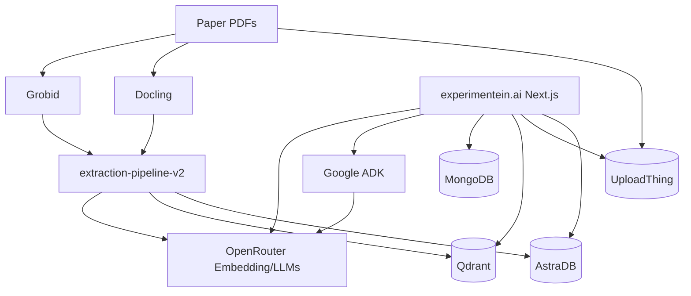

# Babyneers - Vectors in Orbit 2026

## Introduction

This repository documents the work of the Babyneers team during the Vectors in Orbit 2026 hackathon (GDC SupCom x FST, partnered with Qdrant).

We developed Experimentein.ai, a research-first platform for exploring scientific papers, items, and evidence with traceable provenance. The system combines an extraction pipeline, storage services, and a Next.js application to make evidence-centric discovery practical.

## Project Overview

Experimentein.ai treats evidence and items as first-class, structured entities extracted from scientific papers. The system provides:

- Evidence-first indexing and retrieval (papers, sections, blocks, items)
- Similarity-based exploration using vector search
- Explicit provenance with traceable links back to source blocks
- Research collections, activity history, and usage credits

The platform is a research prototype for transparent discovery and comparison of experimental knowledge, not a predictive or outcome-inference system.

## Architecture Overview

The system separates extraction, storage, retrieval, and user interaction across specialized components.

### Storage Layer

- Astra DB (Data API): canonical storage for structured records (papers, sections, blocks, items) with provenance
- Qdrant: vector search over embeddings with lightweight payloads
- MongoDB + Mongoose: authentication, sessions, credits, and app-level data

### Processing Stack

- Docling and GROBID: PDF to structured content and TEI extraction
- lxml + spaCy: document parsing and block normalization
- UploadThing: asset uploads (PDFs, tables, images)
- Embeddings: vector generation for similarity search
- Google ADK + OpenRouter: in-app AI agent and model access

### Web Application

- Next.js 16 (App Router) with React 19
- Auth.js (NextAuth) with Google and GitHub providers
- Evidence viewer with highlights and traceability

## Key Design Decisions

- Split storage for auditability and speed: Astra DB as the canonical source, Qdrant for fast similarity search.
- Evidence-first UX: every surfaced result is traceable back to source blocks.
- Modular pipeline: pdf_to_infra, structure_to_blocks, and blocks_to_items can evolve independently.
- App data isolation: MongoDB holds user and product data, separate from scientific records.
- Vendor-agnostic AI access: OpenRouter provides model selection while ADK handles agent logic.

## Repository Structure

Each module has its own README with setup and usage details.

```
vectors-in-orbit-2026/
|-- extraction-pipeline-v2/   # PDF processing and itemization pipeline
|-- experimentein.ai/         # Next.js web application
|-- grobid-instance/          # GROBID + Flask API wrapper
|-- scrapper-service/         # Asset upload / scraping service
|-- README.md                 # This file
```

## System Diagram



## Modules

### extraction-pipeline-v2

Second-generation pipeline to turn PDFs into structured items. It includes:

- pdf_to_infra: ingest PDFs, extract tables/figures, upload assets
- structure_to_blocks: normalize structure into blocks/sections/papers
- blocks_to_items: retrieval-first candidate discovery and deterministic merging
- storage: Astra + Qdrant clients, schema manifests, init scripts

See `extraction-pipeline-v2/README.md` for the pipeline flow, specs, and quick start.

### experimentein.ai

Next.js app for search, evidence viewing, research collections, and AI assistance.

Key features:

- Evidence-first search across papers, sections, blocks, and items
- Research collections, activity tracking, and credits ledger
- PDF evidence viewer with highlights
- Auth.js (NextAuth) with Google/GitHub providers
- AI agent powered by Google ADK + OpenRouter

See `experimentein.ai/README.md` for environment variables and run commands.

### grobid-instance

Dockerized GROBID service with a small Flask API for TEI extraction.

Endpoints:

- GET / (health check)
- POST /process (multipart/form-data with PDF field name "file")

We also host a Docling instance (similar to GROBID) using docling-serve:

```
https://github.com/DS4SD/docling-serve
```

See `grobid-instance/README.md` for usage.

### scrapper-service

Lightweight service (Bun + Express) used for asset ingestion and uploads (UploadThing).

See `scrapper-service/package.json` for scripts and dependencies.

## Technology Stack (Current)

| Component | Technology | Purpose |
| --- | --- | --- |
| PDF Processing | Docling, GROBID | Convert PDFs to structured content |
| XML Parsing | lxml | Parse and extract from TEI |
| NLP | spaCy | Tokenization and normalization |
| Embeddings | Vector model (configured in pipeline) | Dense vector generation |
| Canonical Storage | Astra DB (Data API) | Full records with provenance |
| Vector Search | Qdrant | Semantic similarity retrieval |
| App Database | MongoDB + Mongoose | User and product data |
| Auth | Auth.js (NextAuth) | Authentication and sessions |
| AI Orchestration | Google ADK + OpenRouter | Agent workflows and LLM access |
| Web Framework | Next.js 16 + React 19 | UI and server logic |

## Getting Started (High Level)

1. Start the GROBID instance (`grobid-instance/`).
2. Run the extraction pipeline (`extraction-pipeline-v2/`).
3. Run the web app (`experimentein.ai/`).

Each module has its own README with detailed instructions and environment variables.

## Team

- Mohamed Amin Abassi
- Fatma Ben Lakdhar
- Rima Ardhaoui
- Amina Bayoudh
- Mohamed Yassine Hemissi

## License

Copyright (c) 2026 Babyneers Team. All rights reserved.
