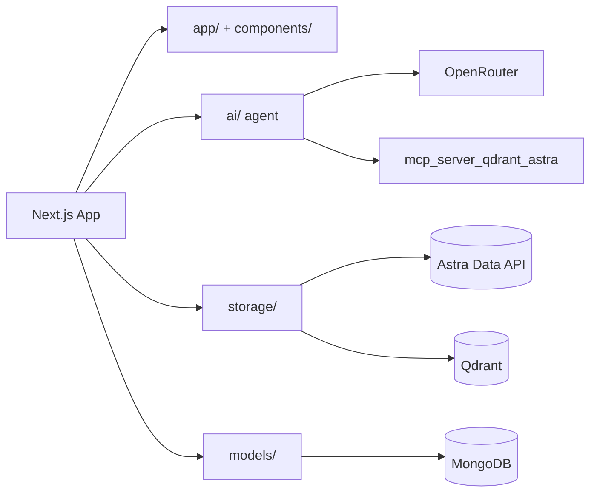

# Experimentein.ai



Experimentein.ai is a research-first platform for exploring scientific papers, items, and evidence with traceable provenance.

## Features

- Evidence-first search across papers, sections, blocks, and items
- Structured research collections ("Research") with saved items
- Credits system with ledger + receipts
- Activity tracking and recent actions
- PDF evidence viewer with highlights
- Auth via Auth.js (NextAuth)
- AI agent powered by OpenRouter via LangGraph

## Tech Stack

- Next.js 16 (App Router, Turbopack)
- React 19
- MongoDB + Mongoose
- Astra DB (Data API)
- Qdrant (vector search)
- Auth.js (NextAuth)
- LangGraph + OpenRouter

## Project Structure

- `app/`  Next.js routes (static, guest, auth)
- `components/`  UI components
- `storage/`  Data access + search
- `models/`  Mongoose schemas
- `ai/`  LangGraph agent + OpenRouter adapter

## Getting Started

### 1) Install

```bash
bun install
```

### 2) Environment Variables

Create `.env` with:

```
# NextAuth
NEXTAUTH_URL=
NEXTAUTH_SECRET=
AUTH_SECRET=

# OAuth (GitHub is enabled; Google is configured but disabled by code)
GITHUB_CLIENT_ID=
GITHUB_CLIENT_SECRET=
GOOGLE_CLIENT_ID=
GOOGLE_CLIENT_SECRET=

# MongoDB
MONGODB_URI=

# OpenRouter (LLM + embeddings)
OPENROUTER_API_KEY=
OPENROUTER_API_BASE=https://openrouter.ai/api/v1
OPENROUTER_EMBEDDING_MODEL=baai/bge-m3
OPENROUTER_EMBEDDING_DIM=1024

# Qdrant MCP (optional)
MCP_QDRANT_URL=http://127.0.0.1:8000
MCP_QDRANT_API_KEY=
MCP_QDRANT_API_KEY_HEADER=
MCP_QDRANT_HEADERS={}
MCP_QDRANT_COLLECTION=
MCP_DEBUG=

# Qdrant
QDRANT_URL=
QDRANT_API_KEY=

# Astra Data API
ASTRA_DB_API_ENDPOINT=
ASTRA_DB_APPLICATION_TOKEN=
ASTRA_KEYSPACE=
```

### 3) Run

```bash
bun run dev
```

### 4) Build

```bash
bun run build
```

## AI Agent

The in-app agent runs inside the Next.js server:

- API route: `POST /api/agent`
- Uses LangGraph with an OpenRouter-backed LLM
- Conversation history saved in MongoDB
- Summary maintained per conversation

## Notes

- Search history is cached (last 10 searches) to avoid re-querying Qdrant.
- Evidence highlights use `structure_with_offsets` and `docling_ref` fields.
- IDs are hidden in UI; titles/labels are shown instead.

## Deployment

- Ensure all env vars are set in your host (Vercel, etc.)
- Set OAuth callback URLs to:
  - `https://<domain>/api/auth/callback/google`
  - `https://<domain>/api/auth/callback/github`

## License

Private project.
