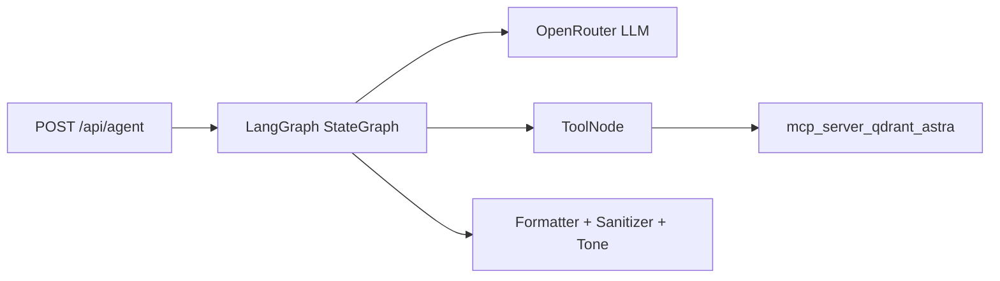

# ai



LangGraph-based agent used by the Next.js app. The agent is not a standalone service.

## How it runs

- Invoked by the app through `POST /api/agent`
- Uses OpenRouter for model access
- Optionally calls MCP tools if `MCP_QDRANT_URL` is set

## Development

Run the app from `experimentein.ai/`:

```bash
bun run dev
```
