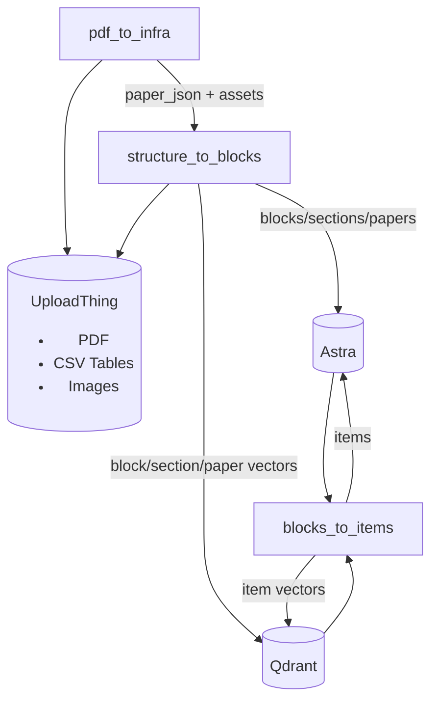

# extraction-pipeline-v2

## Overview

`extraction-pipeline-v2` is the second-generation pipeline for turning PDFs into structured, searchable items.

## Modules

- `pdf_to_infra`  ingest PDFs, call Docling/Grobid, extract tables/figures, upload assets, store `papers_data`.
- `structure_to_blocks`  normalize structure into blocks/sections/papers, summarize sections, store in Astra and Qdrant.
- `blocks_to_items`  retrieval-first candidate discovery and deterministic merging, store items.
- `storage`  Astra/Qdrant clients + schema manifests + init script.

## Quick start

1. Copy `.env.example` to `.env` and fill secrets.
2. Run `storage/init_db.py` to create tables/collections.
3. Run `pdf_to_infra` to ingest a PDF.
4. Run `structure_to_blocks` to normalize and store blocks/sections.
5. Run `blocks_to_items` to generate items.

## Docs

- `V2.2.MD`  previous pipeline spec (with extraction).
- `V2.3.MD`  current pipeline spec (no Stage C/F).
- `SCHEMASV2.3.MD`  schema reference for UI integration.

 BABYNEERS
*This is a generated AI README under instructions.*
