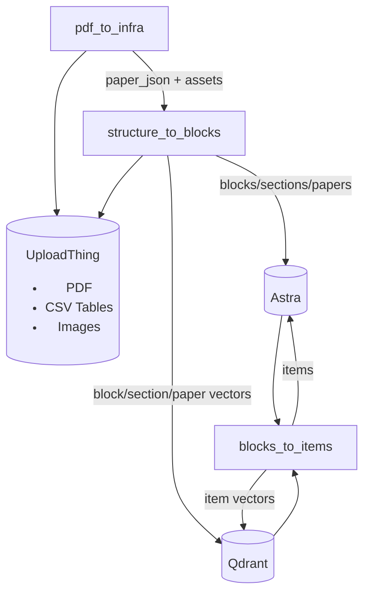
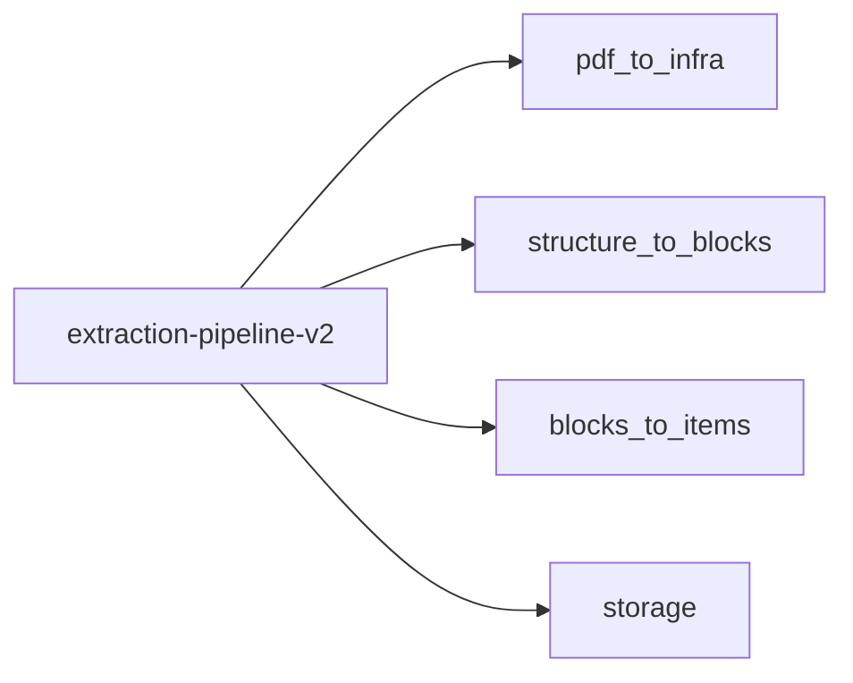

# extraction-pipeline-v2


```mermaid
flowchart TD
  A[pdf_to_infra] --> F[(UploadThing <ul><li>PDF</><li>CSV Tables</><li>Images</></ul> )]
  A[pdf_to_infra] -->|paper_json + assets| B[structure_to_blocks]
  B -->F[(UploadThing <ul><li>PDF</><li>CSV Tables</><li>Images</></ul> )]
  B -->|blocks/sections/papers| C[(Astra)]
  B -->|block/section/paper vectors| D[(Qdrant)]
  C --> E[blocks_to_items]
  D --> E
  E -->|items| C
  E -->|item vectors| D
```


```mermaid
flowchart LR
  EP[extraction-pipeline-v2]
  EP --> PDF[pdf_to_infra]
  EP --> STB[structure_to_blocks]
  EP --> BTI[blocks_to_items]
  EP --> ST[storage]
```

## Overview

`extraction-pipeline-v2` is the second-generation pipeline that turns PDFs into structured, searchable items.

## Modules

- `pdf_to_infra`  ingest PDFs, call Docling/GROBID, extract assets, upload files via scrapper-service (UploadThing), and store `papers_data` in Astra.
- `structure_to_blocks`  normalize structure into papers/sections/blocks, summarize sections, embed to Qdrant, and store in Astra.
- `blocks_to_items`  retrieval-first candidate discovery, deterministic merging, and item storage.
- `storage`  Astra + Qdrant clients, schemas, and `init_db.py`.

## Quick Start

1. Create `extraction-pipeline-v2/.env` with required env vars (see below).
2. Run `storage/init_db.py` to create tables/collections.
3. Run `pdf_to_infra` to ingest a PDF.
4. Run `structure_to_blocks` to normalize and store blocks/sections.
5. Run `blocks_to_items` to generate items.

### Typical commands

```bash
# from extraction-pipeline-v2/
python -m storage.init_db
python -m pdf_to_infra.api
python -m structure_to_blocks --hash <paper_hash>
python -m blocks_to_items --paper-id <paper_hash>
```

## Environment Variables (minimum)

- `DOCLING_URL`, `DOCLING_TOKEN` (or `DOCLING_API_KEY`)
- `GROBID_URL`
- `SCRAPPER_URL` (default: http://127.0.0.1:4010)
- `ASTRA_DB_SECURE_CONNECT_BUNDLE` or bundled file in `storage/astra/`
- `ASTRA_DB_CLIENT_ID`, `ASTRA_DB_CLIENT_SECRET` (or `ASTRA_DB_TOKEN_JSON`)
- `QDRANT_URL`, `QDRANT_API_KEY`
- `OPENROUTER_API_KEY` (summaries + embeddings)
- `OPENAI_API_KEY` (LLM candidate extraction in blocks_to_items)

## Notes

- This pipeline uses Astra Cassandra (secure connect bundle), not the Astra Data API.
- Docling and GROBID are external services; make sure they are reachable before running `pdf_to_infra`.

 BABYNEERS
