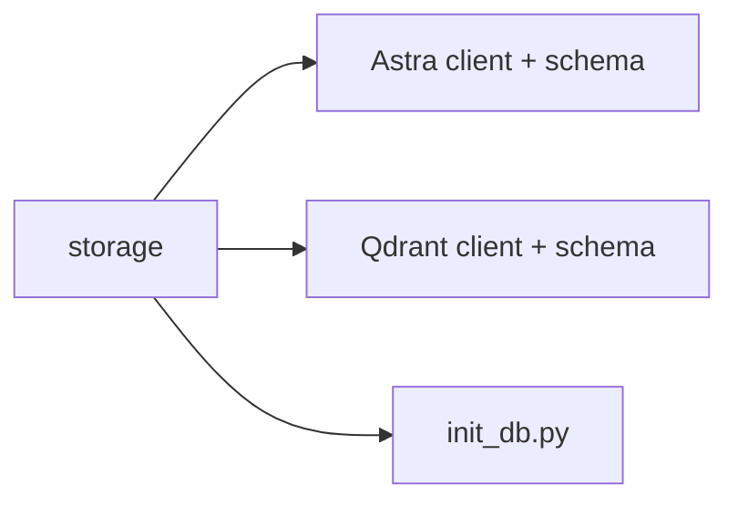

# storage

Shared storage clients and schemas for Astra and Qdrant.

## What it contains

- Astra Cassandra client factory (secure connect bundle + credentials)
- Qdrant client factory
- Schema files for Astra tables and Qdrant collections
- `init_db.py` to create tables/collections from schema manifests

## Environment Variables

Astra Cassandra:
- `ASTRA_DB_SECURE_CONNECT_BUNDLE` (optional if bundle file exists in `storage/astra/`)
- `ASTRA_DB_CLIENT_ID`
- `ASTRA_DB_CLIENT_SECRET`
- or `ASTRA_DB_TOKEN_JSON` (path to token JSON)

Qdrant:
- `QDRANT_URL`
- `QDRANT_API_KEY`
- `QDRANT_TIMEOUT_SEC` (optional)

## Used by

- `pdf_to_infra`
- `structure_to_blocks`
- `blocks_to_items`

© BABYNEERS
