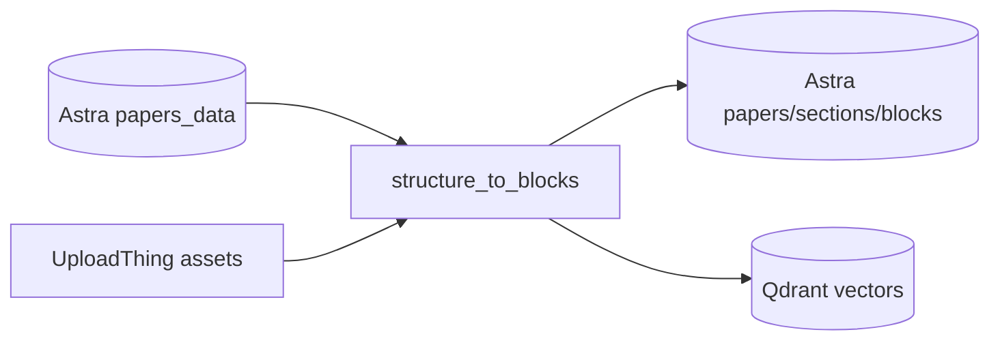

# structure_to_blocks



Transforms stored paper structure into normalized sections and blocks, then persists them for retrieval.

## What it does

- Loads `paper_json` from Astra `papers_data`.
- Downloads `structure.json` and related assets from UploadThing.
- Builds sections and blocks with stable UUIDs.
- Normalizes block types: `text`, `table`, `figure`.
- Summarizes sections for later retrieval.
- Stores data into Astra tables (`papers`, `sections`, `blocks`).
- Embeds and upserts vectors into Qdrant (`papers`, `sections`, `blocks`).

## Inputs

- `paper_hash` (used to fetch UploadThing URLs and metadata)

## Outputs

- Astra records for papers/sections/blocks
- Qdrant vectors for papers/sections/blocks

## Environment Variables

- `OPENROUTER_API_KEY`
- `OPENROUTER_BASE_URL` (optional, default: https://openrouter.ai/api/v1)
- `OPENROUTER_EMBEDDING_MODEL` (optional, default: baai/bge-m3)
- `QDRANT_URL`, `QDRANT_API_KEY`
- Astra Cassandra credentials (see `storage/README.md`)

## Run

```bash
python -m structure_to_blocks --hash <paper_hash>
```

 BABYNEERS
