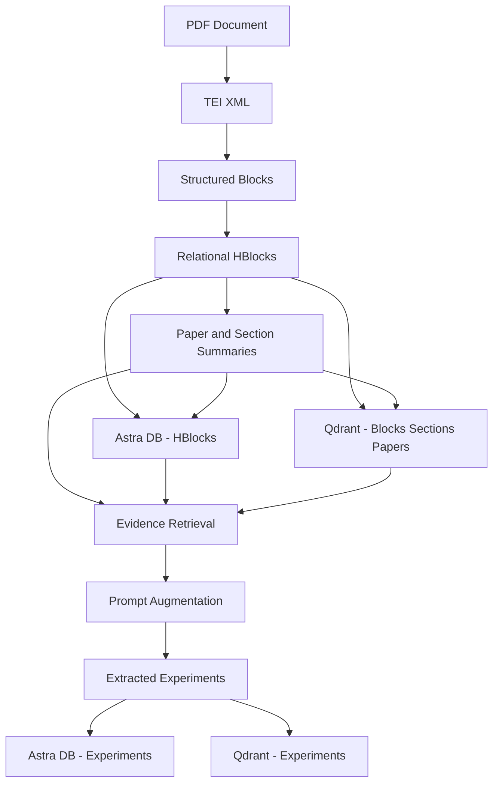

# extraction-pipeline

This folder contains the full document → experiments pipeline, split into modular stages.

## Diagram


## Modules

### `pdf_to_tei/`
**Purpose:** Convert PDF into TEI XML using GROBID.  
**Tech used:** `requests`, GROBID API.

### `tei_to_blocks/`
**Purpose:** Convert TEI XML into structured blocks with stable IDs and section paths.  
**Tech used:** `lxml`, `pandas` (table parsing), `spacy` (sentence chunking).

### `blocks_to_hblocks/`
**Purpose:** Normalize, de-noise, and convert blocks into relational hblocks (sections + blocks + optional links).  
**Tech used:** Python `dataclasses`, regex utilities.

### `hblocks_summarizer/`
**Purpose:** Generate section summaries and a paper summary for retrieval and routing.  
**Tech used:** OpenAI SDK (OpenRouter-compatible endpoints), JSON I/O.

### `hblocks_to_storage/`
**Purpose:** Persist hblocks into Astra (CQL) and Qdrant; embed blocks/sections/papers.  
**Tech used:** `fastembed` (BAAI/bge-base-en-v1.5), `qdrant-client`, `cassandra-driver`.

### `hblocks_to_experiments/`
**Purpose:** Experiment extraction with augmentation + evidence retrieval, returning flat experiment objects.  
**Tech used:** OpenAI SDK (Llama‑3 70B via custom base URL), Astra CQL, Qdrant vector search, `fastembed` for query embeddings.

### `experiments_to_storage/`
**Purpose:** Store extracted experiments into Astra and Qdrant.  
**Tech used:** `fastembed`, `qdrant-client`, `cassandra-driver`.

### `storage/`
**Purpose:** Initialization-only wrappers + schema files for Astra and Qdrant.  
**Tech used:** CQL schema files, Qdrant JSON schemas.

## Scripts

- `pipeline.py`  
  Runs the full pipeline from PDF/TEI through storage; optional experiment extraction.

- `init_db.py`  
  Initializes Astra/Qdrant schemas and indexes.

## Artifacts

- `results.json`  
  Latest experiment extraction output (for testing/inspection).

## Notes

- Storage uses Astra DB (CQL) and Qdrant with separate collections for blocks/sections/papers/experiments.
- Embeddings use `BAAI/bge-base-en-v1.5` (768‑dim).
- LLM calls are OpenAI‑SDK compatible with custom base URLs (OpenRouter/Groq).

## Cost & Time Estimation (LLM Calls)

Use the formulas below to estimate per‑paper cost and latency. Plug in your provider’s current rates.

**Definitions**
- `Tin` = total input tokens sent to LLMs
- `Tout` = total output tokens from LLMs
- `Cin` = cost per 1K input tokens
- `Cout` = cost per 1K output tokens
- `Rin` = input tokens/sec throughput
- `Rout` = output tokens/sec throughput

**Estimated cost**
```
cost_usd = (Tin / 1000) * Cin + (Tout / 1000) * Cout
```

**Estimated time**
```
time_sec = (Tin / Rin) + (Tout / Rout)
```

**Typical token buckets per paper (fill with your real counts)**
- Summaries: `Tin_summaries`, `Tout_summaries`
- Experiment discovery (Stage A): `Tin_stage_a`, `Tout_stage_a`
- Extraction (Stage C): `Tin_stage_c`, `Tout_stage_c`
- Dedup/validation: `Tin_dedup`, `Tout_dedup`

Total:
```
Tin  = Tin_summaries + Tin_stage_a + Tin_stage_c + Tin_dedup
Tout = Tout_summaries + Tout_stage_a + Tout_stage_c + Tout_dedup
```
