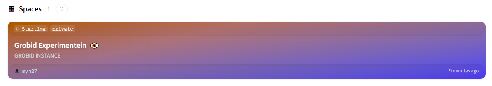

# Gorbid Instance (HF Experimentein)
 


This Space runs a local GROBID service and exposes a small Flask API for TEI extraction.
 
Endpoints
- GET / : health check
- POST /process : multipart/form-data with a PDF file in field name "file"
 
Example (local)
```bash
curl -X POST http://localhost:7860/process \
  -F "file=@/path/to/paper.pdf" \
  -H "Accept: application/xml"
```
